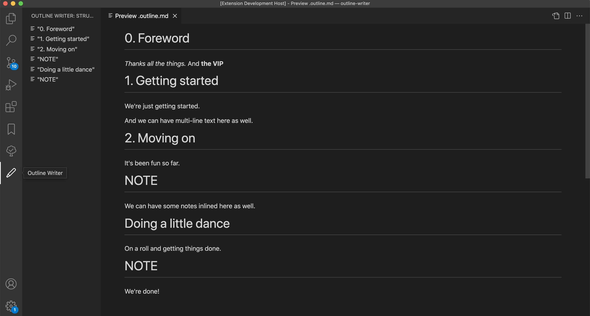

# Outline Writer

Display text outline, gathered from files with synopsis in YAML front matter.



## Get started

1. Add YAML front matter to your text files, for example:
    ```yaml
    ---
    title: Get started
    synopsis: Describes how to get started
    ---
    ```

1. Add an `.outline` file in the root of the directory where the text files are located.

   Each line should be a relative path to a file that should be included in the outline, for example:
   ```txt
   ./0. Foreword.md
   ./Chapter 1/1. Getting started.md
   ./Chapter 1/2. Moving on.md
   ./Chapter 2/At the disco/Dancing.md
   ```

   To easily generate the `.outline` for all Markdown files recursively in a directory:

   ```sh
   $ cd <project directory>
   $ find . -name "*.md" | sort > .outline
   ```


## Features

This extension supports the following fields in YAML front matter:
* `title`: May be empty, defaults to the filename.
* `synopsis`: May be empty, defaults to empty string.

The generated outline is accessible either via the Activity Bar, or via the context menu when right-clicking a `.outline` file in the File Explorer.


## Extension Settings

This extension contributes the following settings:

* `outline-writer.outlineFormat`: which format the outline should be rendered as.


#### Icon

The icon of this extension is a derivative of "Pen by VectorsLab from the Noun Project", used under CC BY.
