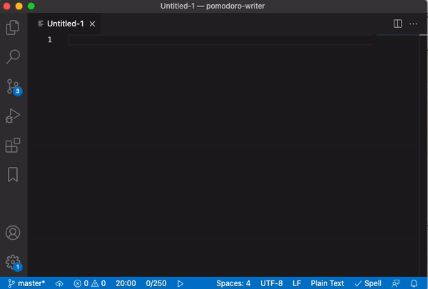

# pomodoro-writer 

Pomodoro timer combined with an optional word count goal for each session.

## Features

Simply start the timer from the status bar:


To change the work time or word count goal, click each item and enter the value:




## Extension Settings

It is recommended to show the status bar and allow notifications in Zen Mode (if you use that) to know when the timer ends and the word count goal is reached:
```json
 "zenMode.hideStatusBar": false,
 "zenMode.silentNotifications": false
 ```


#### Icon
The icon of this extension is a derivative of "Pen by VectorsLab from the Noun Project" and "Tomato Timer by Nick Bluth from the Noun Project", used under CC BY.
